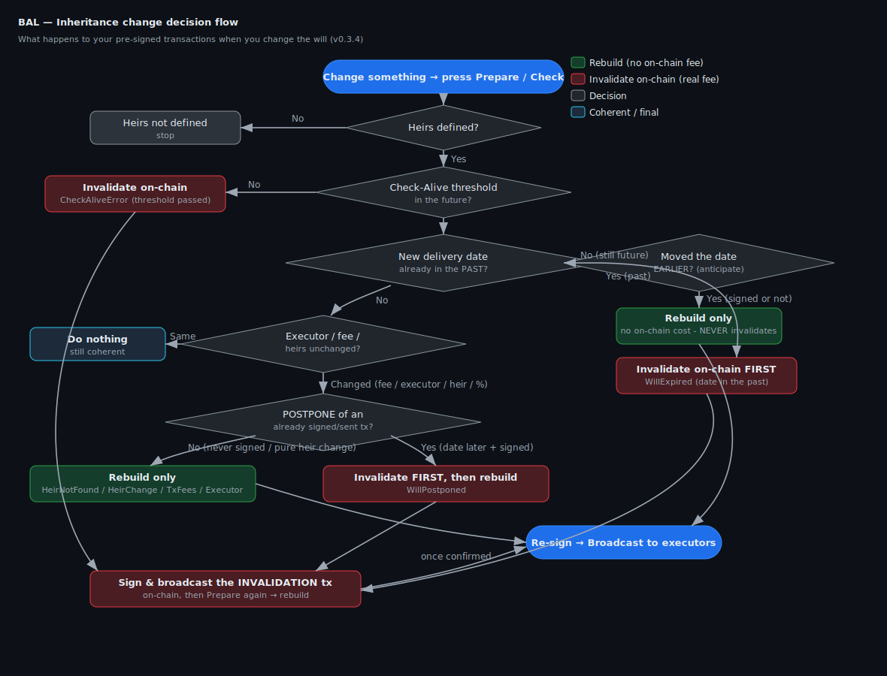

# BAL — Inheritance Options Guide

> How the **Bitcoin After Life** Electrum plugin reacts to every change you can
> make to your will: changing the date (earlier / later), adding or removing an
> heir, changing percentages, fees or will‑executors — and what happens to the
> transactions held by the will‑executor servers.

This guide describes the **actual behaviour of the code** (`core/will.py` →
`is_will_valid` / `check_willexecutors_and_heirs` and
`gui/qt/window.py` → `build_inheritance_transaction`). It is meant for end
users *and* for anyone who wants to understand the on‑chain consequences of
each action.

---

## 1. The mental model in one paragraph

Your will is a **tree of pre‑signed Bitcoin transactions**. Each leaf
transaction sends your coins to your heirs and is **time‑locked** (`nLockTime`)
so it can only be broadcast **after** a future date/block. A copy of each signed
transaction is handed to one or more **will‑executor servers**. While you are
alive you periodically prove you are alive (the *Check‑Alive threshold*). When
you change anything in your will, BAL must decide between three outcomes:

1. **Do nothing** — the will is still coherent.
2. **Rebuild** (re‑prepare + re‑sign, *no on‑chain cost*) — the will changed but
   nothing dangerous is already committed.
3. **Invalidate on‑chain first** (costs a real Bitcoin fee) — a previously
   **signed/sent** transaction must be neutralised by spending its inputs,
   *before* a new will can safely replace it.

The whole point of rule 3 is safety: **a will‑executor must never be able to
broadcast an old transaction that would execute your inheritance too early.**

---

## 2. Transaction states (status flags)

Every will item (`WillItem`) carries a set of boolean status flags. The most
important ones:

| Status | Meaning | Set when |
|---|---|---|
| `VALID` | The item is the current, usable plan | default `True`; cleared by INVALIDATED/REPLACED/CONFIRMED/MEMPOOL |
| `COMPLETE` (*Signed*) | The transaction has been **signed** | after you press **Sign** |
| `PUSHED` | The signed tx was **sent to the will‑executor(s)** | after **Broadcast** to executors |
| `CHECKED` | The will‑executor **confirmed** it holds the tx | after a successful server **Check** (implies `PUSHED`) |
| `CHECK_FAIL` | The server **check failed** | a queried executor did not return the tx |
| `PUSH_FAIL` | Sending to the executor failed | cleared when PUSHED becomes true |
| `CONFIRMED` | The tx is **mined on‑chain** | seen on‑chain with height > 0 |
| `MEMPOOL` | The tx is **in the Electrum mempool** (height 0) | seen on‑chain, not yet mined (was named `PENDING` before v0.3.4) |
| `INVALIDATED` | Its inputs were spent → it can never confirm | invalidation tx created / inputs gone |
| `REPLACED` | Superseded by a child tx with **earlier** locktime | a replacing child was found |
| `ANTICIPATED` | Its locktime was anticipated by 1 day vs a pre‑existing tx with the same heirs | `set_anticipate` (the tx **stays** `VALID`) |
| `UPDATED` | Replaced by a new tx that keeps the **same** locktime **and** same heirs | a same‑locktime replacement was applied (the tx **stays** `VALID`) |
| `EXPIRED` | Its locktime is already in the past relative to the check date | `check_will_expired` |

Flag transitions enforced by `set_status` (the safety rules baked in the code):

- Setting `INVALIDATED` / `REPLACED` / `CONFIRMED` / `MEMPOOL` → clears `VALID`.
- Setting `ANTICIPATED` → **keeps** `VALID` (anticipating only moves the locktime
  1 day earlier; the tx stays valid).
- Setting `UPDATED` → **keeps** `VALID` (same locktime + same heirs; the tx stays
  valid).
- Setting `CONFIRMED` / `MEMPOOL` → clears `INVALIDATED`.
- Setting `PUSHED` → clears `PUSH_FAIL` **and** `CHECK_FAIL`.
- Setting `CHECKED` → implies `PUSHED` (and clears `PUSH_FAIL`).

### How states map to row colour in the list

The colour is decided by `status_color` (in `gui/qt/theme.py`). The list below is
in the exact priority order used by the code — the **first** matching status
wins:

| Priority | State | Colour | Hex |
|---|---|---|---|
| 1 | `INVALIDATED` | orange | `#f87838` |
| 2 | `REPLACED` | pink | `#ff97e9` |
| 3 | `UPDATED` | light violet | `#b266b2` |
| 4 | `CONFIRMED` | grey | `#bfbfbf` |
| 5 | `MEMPOOL` | yellow | `#ffce30` |
| 6 | `CHECK_FAIL` (and **not** `CHECKED`) | red | `#e83845` |
| 7 | `CHECKED` | green | `#8afa6c` |
| 8 | `PUSH_FAIL` | red | `#e83845` |
| 9 | `PUSHED` | teal | `#73f3c8` |
| 10 | `COMPLETE` (signed, **not** yet pushed) | blue | `#2bc8ed` |
| — | none of the above (e.g. plain `VALID`, prepared) | default white | `#ffffff` |

> **Note (v0.3.3 fix):** a will that is *signed but not yet broadcast*
> (`COMPLETE` and **not** `PUSHED`) is **not** queried on the server, so it stays
> **blue** instead of turning red. Only `PUSHED` wills are server‑checked.

---

## 3. The decision flow

When you press **Prepare** (or on the periodic **Check**, or when Electrum
closes), BAL runs `is_will_valid`. Depending on what it finds it raises a
specific exception, and each exception maps to one action.

> 📊 A styled version of this guide (with a live diagram) is in
> [`inheritance-options.html`](./inheritance-options.html) — open it via GitHub
> Pages or download and open it in any browser.

The static diagram below renders everywhere; the Mermaid block after it renders
live on GitHub.



```mermaid
flowchart TD
    A([You change something & press Prepare / Check]) --> B{Heirs defined?}
    B -- No --> Z1[/Show: "Heirs are not defined" — stop/]
    B -- Yes --> C{Check-Alive threshold<br/>in the future?}
    C -- No, it's in the past --> INV1[[Invalidate on-chain<br/>CheckAliveError]]
    C -- Yes --> D{New delivery date<br/>already in the PAST?}

    D -- "Yes (date is now expired)" --> INV2[[Invalidate on-chain FIRST<br/>WillExpired]]
    D -- "No (date still in the future)" --> AN{Did you move the date<br/>EARLIER (anticipate)?}

    AN -- "Yes (anticipate) — signed or not" --> R1[[Rebuild only<br/>no on-chain cost<br/>NEVER invalidates]]
    AN -- "No" --> F{Will-executor / fee /<br/>heirs unchanged?}
    F -- "Fee changed" --> R2[[Rebuild<br/>TxFeesChanged]]
    F -- "Will-executor changed/absent" --> R3[[Rebuild<br/>WillExecutorNotPresent / Change]]
    F -- "Heir added or removed,<br/>% or address changed" --> G{Is it a POSTPONE of an<br/>already signed/sent tx?}

    G -- "Yes (date later + signed/sent)" --> INV3[[Invalidate on-chain FIRST,<br/>then rebuild — WillPostponed]]
    G -- "No (never signed, or pure heir/% change)" --> R4[[Rebuild only<br/>HeirNotFound / HeirChange]]

    F -- "Nothing changed" --> OK([Will still coherent — do nothing])

    R1 --> SIGN
    R2 --> SIGN
    R3 --> SIGN
    R4 --> SIGN
    SIGN([Re-sign the new transactions]) --> PUSH([Broadcast to will-executors])

    INV1 --> SB
    INV2 --> SB
    INV3 --> SB
    SB([Sign & broadcast the INVALIDATION tx on-chain]) --> WAIT{Invalidation<br/>confirmed?}
    WAIT -- "Yes" --> REBUILD([Press Prepare again → build the new will])
    REBUILD --> SIGN
```

---

## 4. Every option, explained

### 4.1 Changing the Check‑Alive date / heir locktime

The locktime is the future moment from which a transaction becomes spendable by
the heir. BAL compares the **requested** locktime against the locktime
**frozen inside the already‑signed transaction** (`w.tx.locktime`), which is
exactly what the will‑executors hold — not the in‑memory copy.

| You do… | Tx already signed/sent? | Result | On‑chain fee? |
|---|---|---|---|
| **Move date LATER** (postpone) | **No** (never signed) | Plain **rebuild** (`HeirNotFound` fall‑through) | **No** |
| **Move date LATER** (postpone) | **Yes** | **Invalidate first**, then rebuild (`WillPostponed`) | **Yes** |
| **Move date EARLIER, still in the future** (anticipate) | **any** (signed or not) | Plain **rebuild** with the new earlier locktime (`HeirNotFound` fall‑through) — **never** an on‑chain invalidation | **No** |
| **Move date EARLIER into the past** (new date already passed) | — | Will is genuinely **expired** → **invalidate** (`WillExpired`) | **Yes** |
| Check‑Alive threshold already passed | — | **Invalidate** (`CheckAliveError`) | **Yes** |

> **Why postpone needs an on‑chain invalidation:** the will‑executor still holds
> the *old* transaction with the *earlier* locktime. If you simply re‑signed a
> later one, a malicious or buggy executor could still broadcast the old one as
> soon as its earlier locktime is reached — executing your inheritance too soon.
> Spending the old transaction's inputs on‑chain makes the old tx **un‑minable**.
> The plugin tells you this explicitly and offers to build the invalidation tx.

> **Why anticipate (move earlier, still future) is NOT on‑chain:** moving the
> delivery date *earlier* only makes the inheritance available *sooner*. There is
> no early‑execution risk to protect against — on the contrary, the new plan is
> *more* restrictive than the old one. So the plugin simply **rebuilds** the
> transactions with the new, earlier locktime; **no on‑chain invalidation and no
> Bitcoin fee** are needed. This holds **even if the will was already
> signed/sent**: anticipating never invalidates.
>
> This is the opposite of postpone: postpone (later date) is dangerous because
> the will‑executor could still broadcast the *earlier* old tx; anticipate
> (earlier date) is safe because the old, *later* tx can only ever execute *after*
> the new one.

> **Note — only a date that lands in the *past* invalidates.** "Move date earlier"
> only triggers an on‑chain invalidation in the separate case where the new date
> is already **in the past** relative to the Check‑Alive date: then the will is
> truly *expired* (`WillExpired`) and must be invalidated, exactly like a
> Check‑Alive threshold that has already passed.

### 4.2 Adding an heir

`check_willexecutors_and_heirs` walks every heir in the current set; an heir
present in `heirs` but not yet found in the will raises **`HeirNotFoundException`**.

- **Result:** **rebuild** (re‑prepare + re‑sign).
- **On‑chain fee:** **No** — *unless* the will being changed was already
  signed/sent and the change also moves a locktime later (then the postpone rule
  in 4.1 applies).

### 4.3 Removing an heir

The will still carries an heir that is no longer in your current heirs set →
**`HeirNotFoundException`** (the removed‑heir branch).

- **Result:** **rebuild**, so the removed heir disappears from the new
  transactions.
- **On‑chain fee:** **No** for a will that was only *prepared*. If the old will
  was already signed/sent, you must invalidate it on‑chain first (same safety
  reasoning as a postpone), then rebuild.

> **v0.3.2 fix:** removing an heir is now correctly detected on **Check** and on
> Electrum **close**, not only on Prepare.

### 4.4 Changing an heir's percentage or address

If the stored heir `[address, amount/percentage]` differs from the current one,
the will is no longer coherent → it is treated like an heir change
(**`HeirChangeException`** / `HeirNotFound`).

- **Result:** **rebuild** with the new amounts.
- **On‑chain fee:** **No** (unless the old will was signed/sent → invalidate
  first).

> Reminder shown by the plugin: *“In the inheritance process the entire wallet is
> always fully emptied”* — the amounts across all heirs must add up so that the
> whole spendable balance is distributed; otherwise an `AmountException` warns you
> to adjust.

> **Watch the dust limit.** If a share is so small that it falls below Bitcoin's
> *dust limit*, that heir is skipped (see §4.8). Splitting a tiny balance among
> many heirs, or giving an heir a very small percentage, can produce dust shares.

### 4.5 Changing the transaction fee (sat/byte)

Each will item stores the fee rate it was built with. A different rate raises
**`TxFeesChangedException`**.

- **Result:** **rebuild** at the new fee rate.
- **On‑chain fee:** **No** to rebuild (you only pay when the inheritance — or an
  invalidation — is actually broadcast on‑chain).

### 4.6 Changing or removing a will‑executor

- A selected will‑executor that the will does not reference raises
  **`WillExecutorNotPresent`**.
- A will‑executor whose details changed raises **`WillexecutorChangeException`**.
- Running with “no will‑executor” but no backup transaction raises
  **`NoWillExecutorNotPresent`**.

- **Result:** **rebuild** and re‑distribute to the (new) executor set.
- **On‑chain fee:** **No** to rebuild. The new signed transactions are simply
  pushed to the new/updated executors; the old executor will eventually fail its
  own check and drop the obsolete tx.

### 4.7 Nothing changed

If heirs, percentages, fees, executors and locktimes all still match the signed
transactions, `is_will_valid` returns `True` and **nothing happens** — your will
stays exactly as broadcast to the executors.

### 4.8 An heir's share is below the dust limit (DUST)

Bitcoin refuses to create outputs that are too small to be worth spending — the
so‑called **dust limit** (the wallet's `dust_threshold`). BAL resolves every
heir's final amount when it builds the will (`Heirs.prepare_lists` →
`fixed_percent_lists_amount` / `normalize_perc`) and compares each share against
that limit.

- **Some heirs are dust, others are valid → build continues.** Each dust heir is
  **skipped** (its share would be unspendable). The build proceeds with the
  remaining valid heirs, and the build report lists every excluded heir as
  *“… is DUST – excluded (amount below dust limit)”* so you can see who was left
  out. Behaviour is unchanged: the will is still prepared, signed and checked
  with the payable heirs.

- **EVERY heir is dust → the build is blocked.** If *all* heirs' shares are below
  the dust limit, the inheritance would pay nobody (only the change and the
  will‑executor fee). Previously such an *empty* will was still built, signed,
  checked and shown in the list. As of **v0.4.7** BAL refuses it:
  `Heirs.prepare_lists` raises `HeirAmountIsDustException`, and the **Building
  Will** window stops with a clear **red** message:
  *“All heirs' shares are below the dust limit: the inheritance cannot be
  created. Increase the amounts or reduce the number of heirs.”*
  Nothing is built, signed, checked or added to the list.

> **When does this happen?** Typically with a **very small wallet balance** split
> among **percentage** heirs (e.g. each heir ends up with a few hundred sats), or
> when every fixed amount is set below the dust limit. The fix is exactly what
> the message says: raise the per‑heir amounts, or reduce the number of heirs.

> **Note (v0.4.7):** the dust check lives in `prepare_lists`, which sees **all**
> heirs across **all** locktimes with their final amounts. This is deliberate: a
> single transaction only ever covers the earliest locktime, so checking there
> would wrongly block a will whose *later* dates still have valid heirs.

- **On‑chain fee:** none — this is a pre‑build safety check; nothing is broadcast.

---

## 5. What happens on the will‑executor servers

| Your action | Effect on the servers |
|---|---|
| **Prepare** (rebuild) | Nothing yet — new txs exist only locally until you Sign + Broadcast. |
| **Sign** | Still local; tx becomes `COMPLETE` (blue). |
| **Broadcast to executors** | The signed txs are uploaded; items become `PUSHED`. |
| **Check** | Each `PUSHED` will is queried; success → `CHECKED` (green), failure → `CHECK_FAIL` (red). |
| **Invalidate (on‑chain)** | You spend the committed inputs on the Bitcoin network. Once confirmed, the executor's stored tx can no longer be mined; on the next check it is dropped / shown invalidated. |
| **Re‑broadcast a new will** | Executors replace the obsolete copy with the new signed tx. |

> A row turning **red** (`CHECK_FAIL`) after a Check means a will‑executor that
> *should* hold your transaction did not return it — re‑Broadcast, or rebuild,
> to fix it. A row that is merely **blue** is signed‑but‑not‑yet‑sent and is
> perfectly normal.

---

## 6. Quick reference — does it cost a Bitcoin fee?

| Change | Rebuild? | On‑chain invalidation (real fee)? |
|---|---|---|
| Add heir (will only prepared) | ✅ | ❌ |
| Remove heir (will only prepared) | ✅ | ❌ |
| Change % / address (only prepared) | ✅ | ❌ |
| Change fee rate | ✅ | ❌ |
| Change / remove will‑executor | ✅ | ❌ |
| Move date **earlier, still in the future** (anticipate) — signed **or** not | ✅ | ❌ |
| Move date **earlier into the past** (new date already passed) | ✅ after | ✅ **yes** |
| Move date **later** (postpone) — will **signed/sent** | ✅ after | ✅ **yes** |
| Move date **later** (postpone) — will **only prepared** | ✅ | ❌ |
| Check‑Alive threshold already in the past | ✅ after | ✅ **yes** |
| Any change to an **already signed/sent** will **that postpones it or expires it** | ✅ after | ✅ **yes** (invalidate first) |
| Nothing changed | ❌ | ❌ |
| Every heir's share below the dust limit (all‑dust) — build **blocked** (§4.8) | ❌ | ❌ |

---

## 7. Golden rules

1. **Before it's signed**, changing anything is free — just **Prepare** again.
2. **After it's signed/sent**, only **postponing** the date (moving it *later*),
   or letting it **expire** (a date now in the past), requires an **on‑chain
   invalidation first** (a small Bitcoin fee) so an old transaction can never be
   executed early. **Anticipating** (moving the date *earlier*, still in the
   future) never invalidates — it is just a free **rebuild**.
3. Always finish with **Sign → Broadcast → Check** so the will‑executors hold the
   *current* plan (green), not an obsolete one.
4. The wallet is always **fully emptied** by the inheritance, so heir amounts must
   add up.
5. **Mind the dust limit.** A share below Bitcoin's dust limit is skipped; if
   **every** heir is dust the build is blocked with a clear message (§4.8) —
   raise the amounts or use fewer heirs.

---

*This document reflects BAL plugin v0.4.7. Behaviour is derived directly from
`core/will.py`, `core/heirs.py` and `gui/qt/window.py`.*
