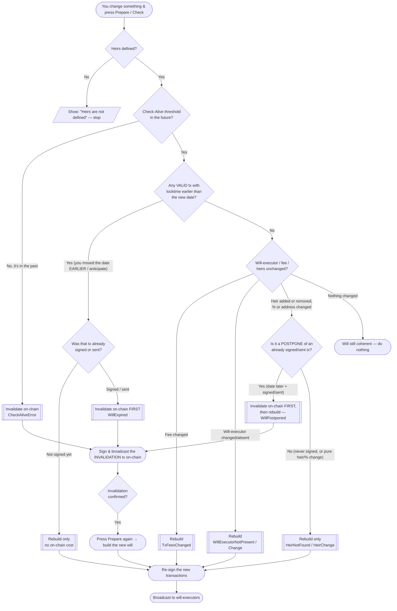

# BAL — Inheritance Options Guide

> How the **Bitcoin After Life** Electrum plugin reacts to every change you can
> make to your will: changing the date (earlier / later), adding or removing an
> heir, changing percentages, fees or will‑executors — and what happens to the
> transactions held by the will‑executor servers.

This guide describes the **actual behaviour of the code** (`core/will.py` →
`is_will_valid` / `check_willexecutors_and_heirs` and
`gui/qt/window.py` → `build_inheritance_transaction`). It is meant for end
users *and* for anyone who wants to understand the on‑chain consequences of
each action.

---

## 1. The mental model in one paragraph

Your will is a **tree of pre‑signed Bitcoin transactions**. Each leaf
transaction sends your coins to your heirs and is **time‑locked** (`nLockTime`)
so it can only be broadcast **after** a future date/block. A copy of each signed
transaction is handed to one or more **will‑executor servers**. While you are
alive you periodically prove you are alive (the *Check‑Alive threshold*). When
you change anything in your will, BAL must decide between three outcomes:

1. **Do nothing** — the will is still coherent.
2. **Rebuild** (re‑prepare + re‑sign, *no on‑chain cost*) — the will changed but
   nothing dangerous is already committed.
3. **Invalidate on‑chain first** (costs a real Bitcoin fee) — a previously
   **signed/sent** transaction must be neutralised by spending its inputs,
   *before* a new will can safely replace it.

The whole point of rule 3 is safety: **a will‑executor must never be able to
broadcast an old transaction that would execute your inheritance too early.**

---

## 2. Transaction states (status flags)

Every will item (`WillItem`) carries a set of boolean status flags. The most
important ones:

| Status | Meaning | Set when |
|---|---|---|
| `VALID` | The item is the current, usable plan | default `True`; cleared by INVALIDATED/REPLACED/CONFIRMED/PENDING |
| `COMPLETE` (*Signed*) | The transaction has been **signed** | after you press **Sign** |
| `PUSHED` | The signed tx was **sent to the will‑executor(s)** | after **Broadcast** to executors |
| `CHECKED` | The will‑executor **confirmed** it holds the tx | after a successful server **Check** (implies `PUSHED`) |
| `CHECK_FAIL` | The server **check failed** | a queried executor did not return the tx |
| `PUSH_FAIL` | Sending to the executor failed | cleared when PUSHED becomes true |
| `CONFIRMED` | The tx is **mined on‑chain** | seen on‑chain with height > 0 |
| `PENDING` | The tx is **in the mempool** (height 0) | seen on‑chain, not yet mined |
| `INVALIDATED` | Its inputs were spent → it can never confirm | invalidation tx created / inputs gone |
| `REPLACED` | Superseded by a child tx with earlier locktime | a replacing child was found |
| `EXPIRED` | Its locktime is already in the past relative to the check date | `check_will_expired` |

Flag transitions enforced by `set_status` (the safety rules baked in the code):

- Setting `INVALIDATED` / `REPLACED` / `CONFIRMED` / `PENDING` → clears `VALID`.
- Setting `CONFIRMED` / `PENDING` → clears `INVALIDATED`.
- Setting `PUSHED` → clears `PUSH_FAIL` **and** `CHECK_FAIL`.
- Setting `CHECKED` → implies `PUSHED` (and clears `PUSH_FAIL`).

### How states map to row colour in the list

| State (first match wins) | Colour | Hex |
|---|---|---|
| `CHECK_FAIL` | red | `#e83845` |
| `INVALIDATED` / `REPLACED` | grey | (muted) |
| `CONFIRMED` | green | (confirmed on server / chain) |
| `COMPLETE` (signed, **not** yet pushed) | blue | `#2bc8ed` |
| `VALID` (prepared, not signed) | default | — |

> **Note (v0.3.3 fix):** a will that is *signed but not yet broadcast*
> (`COMPLETE` and **not** `PUSHED`) is **not** queried on the server, so it stays
> **blue** instead of turning red. Only `PUSHED` wills are server‑checked.

---

## 3. The decision flow

When you press **Prepare** (or on the periodic **Check**, or when Electrum
closes), BAL runs `is_will_valid`. Depending on what it finds it raises a
specific exception, and each exception maps to one action.

> 📊 A styled version of this guide (with a live diagram) is in
> [`inheritance-options.html`](./inheritance-options.html) — open it via GitHub
> Pages or download and open it in any browser.

The static diagram below renders everywhere; the Mermaid block after it renders
live on GitHub.

---

## 4. Every option, explained

### 4.1 Changing the Check‑Alive date / heir locktime

The locktime is the future moment from which a transaction becomes spendable by
the heir. BAL compares the **requested** locktime against the locktime
**frozen inside the already‑signed transaction** (`w.tx.locktime`), which is
exactly what the will‑executors hold — not the in‑memory copy.

| You do… | Tx already signed/sent? | Result | On‑chain fee? |
|---|---|---|---|
| **Move date LATER** (postpone) | **No** (never signed) | Plain **rebuild** (`HeirNotFound` fall‑through) | **No** |
| **Move date LATER** (postpone) | **Yes** | **Invalidate first**, then rebuild (`WillPostponed`) | **Yes** |
| **Move date EARLIER** (anticipate) | any | Old tx becomes **expired** → **invalidate** (`WillExpired`) | **Yes** |
| Check‑Alive threshold already passed | — | **Invalidate** (`CheckAliveError`) | **Yes** |

> **Why postpone needs an on‑chain invalidation:** the will‑executor still holds
> the *old* transaction with the *earlier* locktime. If you simply re‑signed a
> later one, a malicious or buggy executor could still broadcast the old one as
> soon as its earlier locktime is reached — executing your inheritance too soon.
> Spending the old transaction's inputs on‑chain makes the old tx **un‑minable**.
> The plugin tells you this explicitly and offers to build the invalidation tx.

> **Why anticipate is also on‑chain:** moving the date earlier makes the current
> committed tx *expired* relative to the new check date; the safe path is the
> same — invalidate, then rebuild.

### 4.2 Adding an heir

`check_willexecutors_and_heirs` walks every heir in the current set; an heir
present in `heirs` but not yet found in the will raises **`HeirNotFoundException`**.

- **Result:** **rebuild** (re‑prepare + re‑sign).
- **On‑chain fee:** **No** — *unless* the will being changed was already
  signed/sent and the change also moves a locktime later (then the postpone rule
  in 4.1 applies).

### 4.3 Removing an heir

The will still carries an heir that is no longer in your current heirs set →
**`HeirNotFoundException`** (the removed‑heir branch).

- **Result:** **rebuild**, so the removed heir disappears from the new
  transactions.
- **On‑chain fee:** **No** for a will that was only *prepared*. If the old will
  was already signed/sent, you must invalidate it on‑chain first (same safety
  reasoning as a postpone), then rebuild.

> **v0.3.2 fix:** removing an heir is now correctly detected on **Check** and on
> Electrum **close**, not only on Prepare.

### 4.4 Changing an heir's percentage or address

If the stored heir `[address, amount/percentage]` differs from the current one,
the will is no longer coherent → it is treated like an heir change
(**`HeirChangeException`** / `HeirNotFound`).

- **Result:** **rebuild** with the new amounts.
- **On‑chain fee:** **No** (unless the old will was signed/sent → invalidate
  first).

> Reminder shown by the plugin: *“In the inheritance process the entire wallet is
> always fully emptied”* — the amounts across all heirs must add up so that the
> whole spendable balance is distributed; otherwise an `AmountException` warns you
> to adjust.

### 4.5 Changing the transaction fee (sat/byte)

Each will item stores the fee rate it was built with. A different rate raises
**`TxFeesChangedException`**.

- **Result:** **rebuild** at the new fee rate.
- **On‑chain fee:** **No** to rebuild (you only pay when the inheritance — or an
  invalidation — is actually broadcast on‑chain).

### 4.6 Changing or removing a will‑executor

- A selected will‑executor that the will does not reference raises
  **`WillExecutorNotPresent`**.
- A will‑executor whose details changed raises **`WillexecutorChangeException`**.
- Running with “no will‑executor” but no backup transaction raises
  **`NoWillExecutorNotPresent`**.

- **Result:** **rebuild** and re‑distribute to the (new) executor set.
- **On‑chain fee:** **No** to rebuild. The new signed transactions are simply
  pushed to the new/updated executors; the old executor will eventually fail its
  own check and drop the obsolete tx.

### 4.7 Nothing changed

If heirs, percentages, fees, executors and locktimes all still match the signed
transactions, `is_will_valid` returns `True` and **nothing happens** — your will
stays exactly as broadcast to the executors.

---

## 5. What happens on the will‑executor servers

| Your action | Effect on the servers |
|---|---|
| **Prepare** (rebuild) | Nothing yet — new txs exist only locally until you Sign + Broadcast. |
| **Sign** | Still local; tx becomes `COMPLETE` (blue). |
| **Broadcast to executors** | The signed txs are uploaded; items become `PUSHED`. |
| **Check** | Each `PUSHED` will is queried; success → `CHECKED` (green), failure → `CHECK_FAIL` (red). |
| **Invalidate (on‑chain)** | You spend the committed inputs on the Bitcoin network. Once confirmed, the executor's stored tx can no longer be mined; on the next check it is dropped / shown invalidated. |
| **Re‑broadcast a new will** | Executors replace the obsolete copy with the new signed tx. |

> A row turning **red** (`CHECK_FAIL`) after a Check means a will‑executor that
> *should* hold your transaction did not return it — re‑Broadcast, or rebuild,
> to fix it. A row that is merely **blue** is signed‑but‑not‑yet‑sent and is
> perfectly normal.

---

## 6. Quick reference — does it cost a Bitcoin fee?

| Change | Rebuild? | On‑chain invalidation (real fee)? |
|---|---|---|
| Add heir (will only prepared) | ✅ | ❌ |
| Remove heir (will only prepared) | ✅ | ❌ |
| Change % / address (only prepared) | ✅ | ❌ |
| Change fee rate | ✅ | ❌ |
| Change / remove will‑executor | ✅ | ❌ |
| Move date **earlier** (anticipate) | ✅ after | ✅ **yes** |
| Move date **later** (postpone) — will **signed/sent** | ✅ after | ✅ **yes** |
| Move date **later** (postpone) — will **only prepared** | ✅ | ❌ |
| Check‑Alive threshold already in the past | ✅ after | ✅ **yes** |
| Any change to an **already signed/sent** will | ✅ after | ✅ **yes** (invalidate first) |
| Nothing changed | ❌ | ❌ |

---

## 7. Golden rules

1. **Before it's signed**, changing anything is free — just **Prepare** again.
2. **After it's signed/sent**, moving the date or otherwise replacing it requires
   an **on‑chain invalidation first** (a small Bitcoin fee) so an old transaction
   can never be executed early.
3. Always finish with **Sign → Broadcast → Check** so the will‑executors hold the
   *current* plan (green), not an obsolete one.
4. The wallet is always **fully emptied** by the inheritance, so heir amounts must
   add up.

---

*This document reflects BAL plugin v0.3.3. Behaviour is derived directly from
`core/will.py` and `gui/qt/window.py`.*
