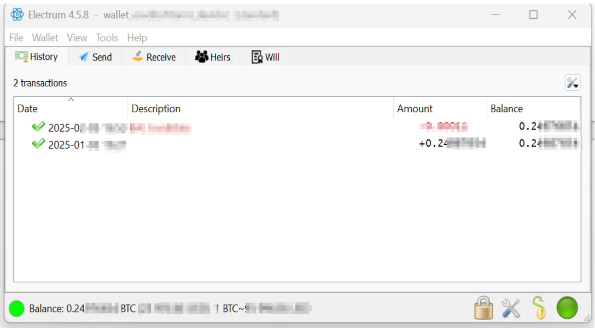
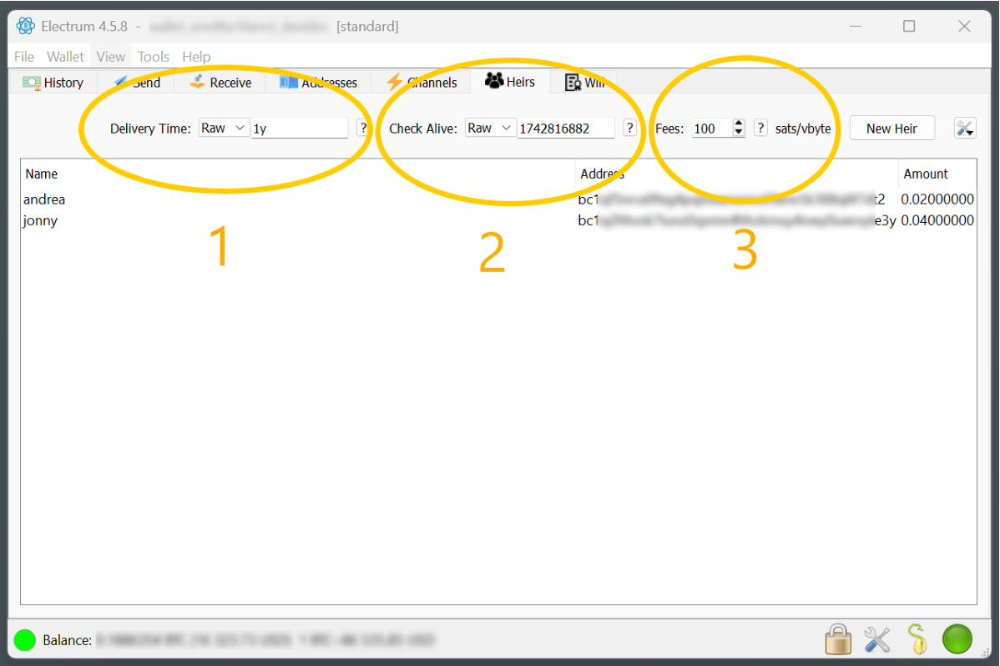
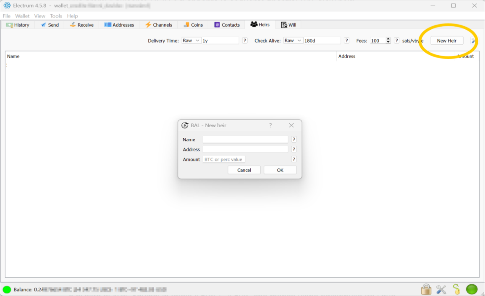
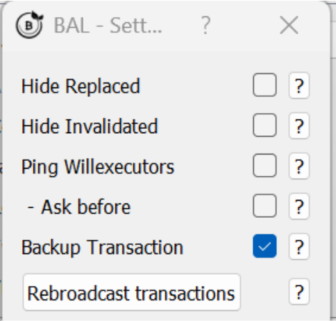
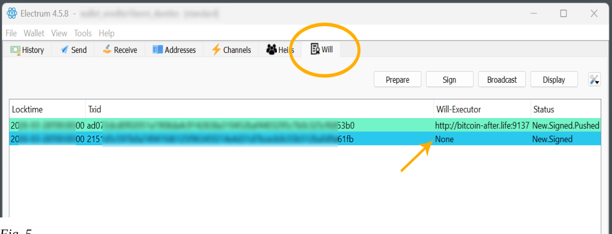
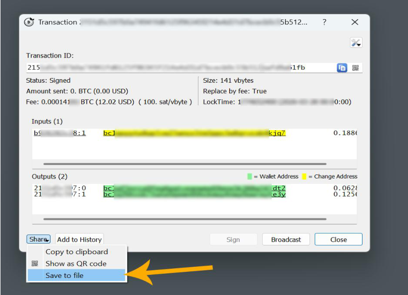
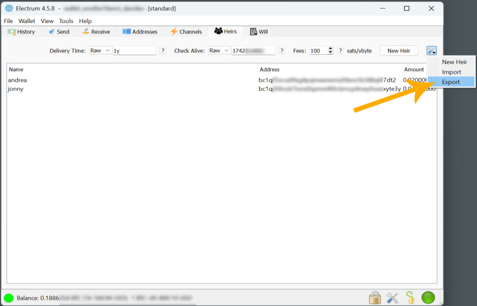
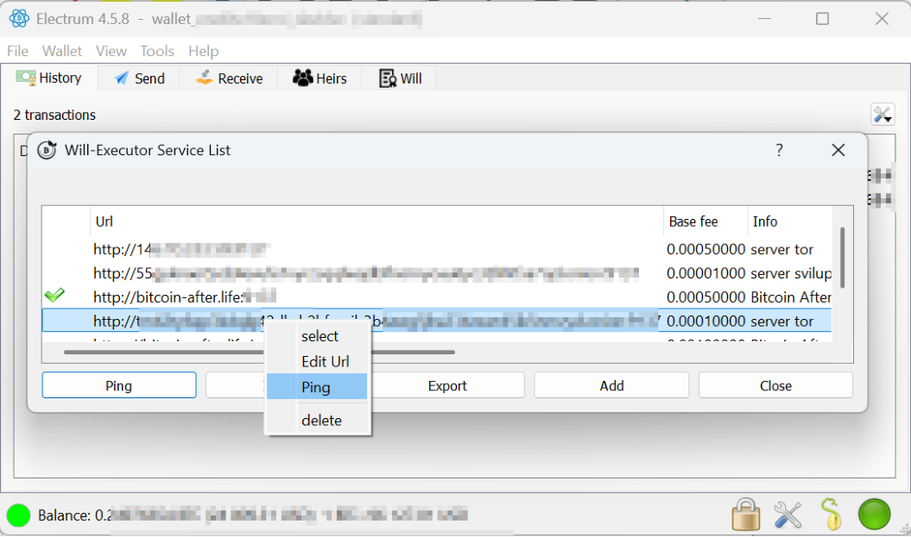
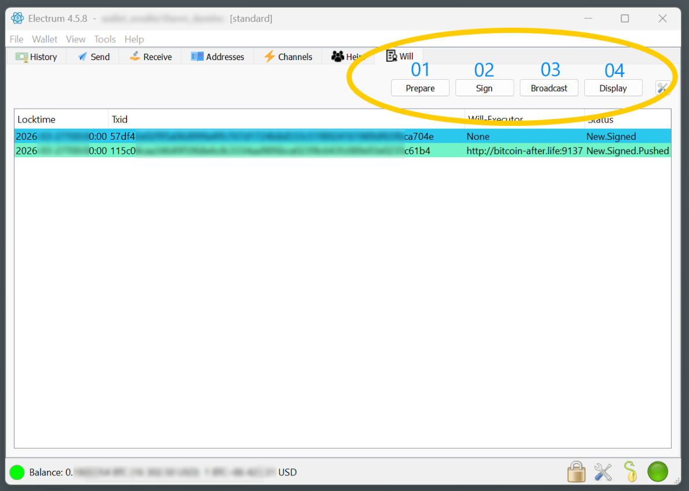
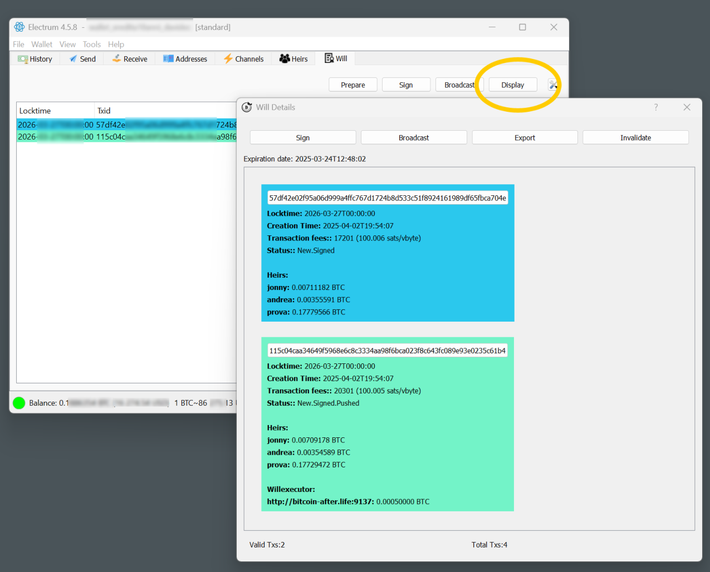

  

<h1 align="center">BitcoinAfter.Life — BAL PROTOCOL 1.0</h1>
<h3 align="center">USER MANUAL (revB)</h3>

> This is the GitHub‑friendly (HTML/Markdown + images) edition of the official
> BAL user manual. The original PDF lives in the
> [bal_plugin_manual](https://bitcoin-after.life/gitea/bitcoinafterlife/bal_plugin_manual)
> Gitea repository. A styled single‑page version is available as
> [`manual.html`](./manual.html).

---

Welcome to using **BAL**, the open‑source plugin for Electrum Wallet, dedicated
to managing **bitcoin digital inheritance**.

An open‑source plugin is a software extension that adds functionality to an
existing program, and whose source code is publicly available. This means that
anyone can view, modify, and distribute the plugin code.

The plugin was designed for **Electrum**, the Gold standard of Bitcoin wallets.

It was not considered reasonable to proceed with the development of a new wallet
or a fork of a wallet (a bifurcation of Electrum's code) so as not to put funds
at risk. Instead, we thought it prudent to lean as a plugin on the most tested
and therefore secure open‑source Bitcoin wallet (**Electrum**), trusting that in
the future the plugin will be placed directly on Electrum by default.

## Installing the BAL plugin

The steps for installing the BAL plugin are very simple:

1. Install the latest version of **Electrum** (Bitcoin wallet).
2. Install the **BAL plugin** (find the files on the Bitcoin‑after.life site or
   links on the Bitcointalk forum), copying it to the Electrum plugins folder.
3. Activate the plugin from the Electrum menu (**Tools → Plugins → BAL**).
4. **Restart Electrum.**

Now you are ready to leave your digital legacy to your heirs!

---

## The BAL interface

*Figure 1 — the screen that appears after starting Electrum with the BAL plugin
installed.*

As you can see there are now two new tabs (**HEIRS** and **WILL**) on the
Electrum interface.

- **HEIRS** = the screen of heirs to whom you want to leave your inheritance.
- **WILL** = the screen that shows you the technical details of your inheritance:
  - locktime
  - creation time
  - transaction fees for miners
  - status
  - heirs
  - will‑executor with associated fees

> **NB:** Inheritance with the BAL plugin can also be set on a wallet that is
> still receiving incoming transactions not yet confirmed on the blockchain.

---

## The HEIRS parameters

You can leave the default plugin parameters; they are more than fine for 99 % of
inheritance cases.

*Figure 2 — the parameters on the HEIRS tab: (1) Delivery Time, (2) Check Alive,
(3) Fees.*

### 1 — Delivery Time (Locktime)

Indicates the date on which the inheritance of your wallet on the blockchain
will be transferred to the recipient. You can enter the inheritance date either
as **Relative** (example: 1 year from today → `RAW = 1y`) or as a **Precise
Date** (`Date`).

If you choose **Raw**, you can insert various options based on a suffix:

- `d`: number of days after the current day (e.g. `1d` means tomorrow)
- `y`: number of years after the current day (e.g. `1y` means one year from today)

\* The locktime can be **anticipated** to update the will.

### 2 — Check Alive (Threshold)

*(i.e. check whether you are still alive, and then postpone the inheritance.)*

This parameter — settable as relative (`RAW`) or absolute (`DATE`) — indicates
the time by which the inheritance will **not** be changed by postponing it.

> **NB:** if you set it negative (i.e. back in time) it is as if it were not
> there. This can be useful for doing quick inheritance tests.

**Example:** if you set the inheritance to one year from today and the Check
Alive (threshold) parameter to 6 months, then in 8 months — if you open
Electrum — the BAL plugin will ask whether you want to update the inheritance
date.

**Why does it do this?** Because it assumes that if you open the Electrum wallet
with the plugin, you are still alive, and therefore estimates that you will
still live a certain amount of time, so you probably want to postpone the
inheritance so as not to transfer it too soon while you are still alive.

#### A practical example

Today is **January 1, 2025**. I set the inheritance for **December 1, 2025**
(11 months from now) and the Check‑Alive (threshold) at **6 months** (so
**June 1, 2025**):

**Future case histories:**

- **Case 1** — I no longer access the Electrum wallet: the inheritance on
  December 1, 2025 will be transferred to the heir (sent to Bitcoin nodes by the
  will‑executors).
- **Case 2** — I access the wallet in 4 months (earlier than the set 6‑month
  Check‑Alive threshold); the inheritance will remain set for December 1, 2025.
- **Case 3** — I access the wallet in 7 months (later than the 6 months set);
  the plugin will ask whether I want to **postpone** the date of the inheritance,
  because it assumes I am still alive and may want to postpone the inheritance so
  as not to transfer it while I am still alive.

### 3 — Fees

Denoted in **satoshi/vbyte**. This parameter indicates the fees that go to the
**miners** to have the transaction validated on the blockchain at the time of
inheritance. It is the classic fee/commission you pay every time you send
bitcoin to another wallet.

We recommend leaving the default value of **100 sat/vbyte**; this way you will be
sure the inheritance is accepted by the miners, even on days when the blockchain
is saturated and network costs are high. (As of January 2025, that is roughly
$25 USD for a wallet without too many UTXOs — a value that allows the tx to be
placed on the blockchain even on congested days.)

---

## IMPORTANT — sizing inheritance transaction amounts

**Automatic sizing to 100 % of the wallet.** The plugin always makes sure that
**ALL** the value of the wallet is delivered to the heirs.

- **Example:** I have a wallet with 3 BTC. I write as inheritance 1 BTC to JONNY
  and 10 % to ANDREA. The BAL plugin sends 1 BTC to Jonny and **all the rest**
  (2 BTC) to Andrea.
- Or: I set 5 % to Jonny and 80 % to Andrea. The plugin **recalculates** the
  percentages proportionally so the wallet is completely emptied. Instead of
  5 %/80 % it sends **5.9 %** to Jonny and **94.1 %** to Andrea, for a total of
  100 %. (Otherwise 15 % would be left in the wallet.)

> **NB:** if you wanted to send only 80 % of the wallet to the heirs and make
> 20 % inaccessible forever (bitcoins lost forever — increasing digital scarcity
> and giving wealth to all bitcoin participants), just set **yourself** as an
> heir with a percentage (e.g. 20 %) to an internal wallet address. This also
> improves the privacy of the transaction, as it is difficult to understand the
> destination wallets.

- **Another example:** I own 10 BTC and want to give Jonny exactly 4 BTC and
  Andrea exactly 2 BTC. What about the missing 4? The plugin recalculates to
  transfer 100 %. The only way to give Jonny and Andrea the exact BTC is to
  transfer the missing 4 to another wallet by designating a **third heir**.

---

## Staggered inheritance over time

Currently **BAL version 1.0** does not support this. It is already in development
for **version 2** of the protocol. In version 2 it will be possible, for
example, to stagger the inheritance 10 % per year until the tenth year, or even
1 % per month, month by month for 10 years — as if it were a kind of annuity,
but without the need for third parties or intermediaries.

---

## The [NEW HEIR] button

After setting steps 1, 2, 3, press the **[New Heir]** button and the *BAL New
Heirs* window appears:

*Figure 3 — adding a new heir.*

Here you enter the following parameters:

- **Name:** name of the heir, with any details you prefer.
- **Address:** the Bitcoin wallet address where the inheritance will be sent.
- **Amount:** how much you want to send to this heir (as a **percentage** or a
  **fixed value**). The plugin always makes sure that 100 % of the inheritance
  is given to the heirs (see *Sizing inheritance transactions*).

> **NB:** You can add several heirs — even 10 or more.

---

## Delivery time changes

If you change the **Delivery Time** of a will, when Electrum closes the BAL
plugin will notify you that you need to update the inheritance.

- **If you postponed the Delivery Time:** the plugin will create a transaction to
  **invalidate** the current inheritance and create a new, postponed one. To do
  this safely, the BAL plugin creates a transaction that it sends to the miners,
  which you will have to **sign**, costing **100 sat/vbyte**.
- **If you anticipated the Delivery Time:** the plugin simply sends a new
  inheritance transaction to the **Will‑Executor servers**, which anticipates and
  thus invalidates the transactions already sent to them.

> 👉 For a complete, code‑accurate breakdown of every change (add/remove heir,
> change percentages, fee, executor, date earlier/later) and whether it costs an
> on‑chain fee, see the companion
> [**Inheritance Options Guide**](../inheritance-options.md).

---

## RAW settings

If you set, for example, `RAW‑1d` and it is, say, 5 p.m., the plugin will not
execute the inheritance precisely 24 hours later (5 p.m. the next day) but will
roughly estimate the blockchain block number corresponding to that time — so
with a tolerance of a few hours.

> **NB:** Inheritance is executed on nodes, on average, with a tolerance of about
> 1 hour after the date/time set in the BAL plugin (because of the 11‑block
> Bitcoin median).

---

## Heirs sheet — quick test tip

If you want a quick test run, enter an upcoming legacy date/time (e.g. 18 hours
later). For such short intervals the **Check Alive** could create problems, so
set the Check Alive parameter **in the past** (a date before today) — e.g. a
previous month.

---

## Practical example — multiple dates

I have 2 children, **Peter** (12) and **Arnold** (16). I own 10 BTC and want
each to receive 5 BTC on their respective 18th birthdays.

In the current BAL plugin (1.0) it is **not** possible to set different delivery
dates — the inheritance date is unique. So in this case I prepare **two wallets**
of 5 BTC each and set the respective inheritance with the BAL plugin. Electrum
helps here, as it lets you easily create and manage multiple wallets.

---

## BAL plugin parameters

Accessible from the menu **Tools → Plugins**.

### Backup Transaction

*Figure 4 — the Backup Transaction option (default: Disabled).*

**Backup Transaction** (default *Disabled*) is used to manage the inheritance
transaction (locktime tx) even **without** the BAL plugin automations that rely
on the online Will‑Executor servers.

By enabling this option you also keep an **offline backup** of the signed legacy
transaction, useful in case all online Will‑Executor servers are destroyed (a
highly unrealistic event).

The backup transaction is saved locally — on a USB stick or wherever you prefer.
For example, it can be delivered through a notary, trusted persons, or even
directly to the heir. (In the latter case, however, the heir becomes aware that
they will receive an inheritance on a specific date and amount, which could be
imprudent.)

The backup transaction, once delivered to the heir, can — at a later date than
the inheritance delivery time — be sent to the nodes via Electrum to receive the
funds in the inheritance wallet.

**Difficulties and risks of using only the backup transaction** (versus trusting
the automation of Will‑Executor servers):

1. Risk of the transaction being **invalidated** later if you accidentally spend
   even one satoshi from one of the wallets you pre‑signed the legacy transaction
   from.
2. Difficulty delivering the signed transaction to the heir (the heir would learn
   about the inheritance and its value).
3. Each step must be handled by hand, with the risk of errors.

If you activated *Backup Transactions* in the parameters, this is visible in the
**[WILL]** screen with the status **NONE** in the Will‑Executor column:

*Figure 5 — backup transaction shown with "NONE" will‑executor.*

Then, by right‑clicking it and selecting **[Details]**, the following screen
appears, where you can save your transaction to your preferred medium (USB flash
drive, cloud, NAS, etc.):

*Figure 6 — transaction details / save dialog.*

---

## Wallet security — saving your will

To keep a copy of your will, simply save the wallet from Electrum
(**File → Save Backup**).

If, for example, your notebook is stolen or breaks down, just install Electrum on
a new computer together with the BAL plugin and open the previously saved wallet.

> **Remember** to save (and not lose) your wallet **password** on Electrum, or
> you will no longer be able to access the inheritance data saved with the
> wallet. If you restore your wallet from **SEED only**, you will regain access
> to your bitcoin funds but **lose the BAL inheritance data** saved with the
> wallet file.

You can also **export the heir list** to keep a printable copy of your
inheritance:

*Figure 7 — exporting / printing the heir list.*

---

## Will‑Executor service list

This window opens from the Electrum menu, **Tools → Will‑executor**, and shows
the official list of will‑executor servers.

If you want to make changes — such as adding an additional will‑executor server —
you can enter it manually or import a list of will‑executor servers (found on the
bitcointalk.org forum or on the official BAL website).

**Commands in the window:**

- **Ping:** checks which servers in the list are online — a **green dot** means
  active.
- **Import:** imports a will‑executor list other than the default.
- **Export:** exports the list of will‑executor servers in your plugin (useful to
  move it to another Electrum + BAL installation).
- **Add:** adds a will‑executor server manually.

### List columns

1. **URL** — the URL address of the will‑executor.
2. **Base Fee** — the commission/reward for the will‑executor. This reward lets
   the will‑executor cover the cost of keeping the server online. The
   will‑executor earns the base fee **only on the date of inheritance**, and only
   if it is the **first** to send the transaction to the nodes — which sets in
   motion a competition among will‑executors to earn the base fee. *(Example: I
   set up an inheritance that will happen in 4 years; in that case the
   will‑executor will only earn the fee in 4 years.)*
3. **Info** — server description or website link.
4. **Default Address** — the bitcoin wallet address where the base fee will be
   sent.
5. **S** — server status. A **green dot** = server online.

**Right‑click** on a server line opens four sub‑commands:

*Figure 8 — the will‑executor context menu.*

1. **Select** — right‑click the server, add the green check mark on the left, and
   this will‑executor will be used in your inheritance.
2. **Edit** — edit the relevant column field.
3. **Ping** — verify that the server is online.
4. **Delete** — delete the server from the list.

---

## Privacy of (online) will‑executors

Transactions sent to will‑executor servers (*pushed*) by the BAL plugin are
stored on the servers. They are **not** publicly accessible (for privacy), but
from your BAL plugin you can check at any time whether the transaction is
properly stored on the servers: right‑click the inheritance transaction in the
**WILL** tab and choose **Check**. The transaction will be tagged in the
**Status** column as **Checked** if it is indeed online on the server.

### WILL tab columns

a. **Locktime** — the date of inheritance.
b. **Txid** — identification of the bitcoin transaction.
c. **Will‑Executor** — address of the will‑executor.
d. **Status** — see the table below.

---

## Colour progression of transaction statuses

Transactions on the **WILL** page are coloured to conveniently display their
**status** of progress. Below are the colour progression states your legacy
transactions can have in the WILL tab, on each will‑executor that is online.

### Chromatic progression table

| # | Status | Meaning | Colour | HEX |
|---|--------|---------|--------|-----|
| 1 | **New** | TX new inheritance | White (transparent) | `#FFFFFF` |
| 2 | **Signed** | TX inheritance signed into the wallet | Azure | `#2BC8ED` |
| 3 | **Pushed** | TX sent to will‑executor | Azure‑green | `#73F3C8` |
| 4 | **Checked** | TX actually present in the will‑executor | Bright green | `#8AFA6C` |
| 5 | **Confirmed** | TX confirmed in the blockchain | Gray | `#BFBFBF` |
| 6 | **Pending** | TX awaiting confirmation on blockchain | Yellow | `#FFCE30` |
| 7 | **Failed** | Communication failure with will‑executor | Red | `#E83845` |
| 8 | **Invalidated** | UTXO input is no longer available | Orange | `#F87838` |
| 9 | **Replaced** | A backdated‑locktime transaction spends the same input | Violet | `#FF97E9` |

---

## WILL tab — commands

*Figure 9 — the WILL tab with its commands.*

1. **Prepare** — prepares the inheritance and puts it on the list.
2. **Sign** — sign your legacy transaction with your private key (using your
   wallet password or hardware key).
3. **Broadcast** — sends the inheritance transaction to the online Will‑Executor
   servers on your *Will‑Executor Service List*.
4. **Display** — brings up the *Will‑Details* window, where you can see the
   transactions with all available data:
   - Locktime (date of inheritance)
   - Creation time
   - Transaction fee (to the miners)
   - Status (see table)
   - Heirs
   - Will‑executor (server address)
   - Commission (base fee) — reward for the will‑executor

*Figure 10 — the Will‑Details window (Display).*

> **NB:** When you close Electrum, the plugin automatically proceeds to execute
> **Prepare → Sign → Broadcast** (if they have not already been completed) to
> ensure the inheritance is correctly executed.

---

## Using hardware keys

**Ledger, BitBox2, etc.** — all hardware keys that are compatible with and
recognised by Electrum are compatible with the BAL plugin.

---

## Insights (privacy)

### Caution: consolidation of UTXOs

When you send the entire contents of a wallet, you risk losing the privacy of
your UTXOs. It may be a good rule of thumb to execute the inheritance leaving a
small remainder to another wallet, to improve the privacy of the transaction —
especially if there is only one heir.

> **Example:** 99.7 % inheritance to the heir and 0.3 % to a random bitcoin
> address (e.g. taken randomly from a block explorer).

---

## Wallet inheritance behaviour when the balance / UTXO changes

If your wallet managed with the BAL plugin changes in balance — e.g. you send
additional funds or spend some — the inheritance **must be updated**.

The BAL plugin takes care, when closing Electrum, to check whether there has been
any such change (balance or UTXO) and then **updates the inheritance
automatically**.

Thanks to this you can use an *inheritance‑ready* wallet on Electrum even for
everyday Bitcoin transactions (possibly with a hardware key to sign), knowing
that in case of death the entire contents of the wallet will be sent to your
heirs.

If you use your **read‑only** wallet on devices other than your Electrum (using
the public key `Zpub`/`Xpub`, e.g. to monitor funds remotely), any funds sent
directly into the wallet **will not** be added to the inheritance already set up.
To work around this, open your wallet on Electrum so the plugin can update the
inheritance UTXOs and re‑send them to the will‑executors, updated with the new
value.

> ⚠️ **WARNING:** If you use the same **SEED** on multiple devices (a behaviour
> always strongly discouraged), spending even one transaction of even one satoshi
> **invalidates** the inheritance, because it changes the wallet's UTXO structure
> and therefore the nodes discard the inheritance transaction.

---

About installing a will‑executor server or collaboration, send your request to:
**info@bitcoin-after.life**

---

<em>Signed, Svātantrya</em>

